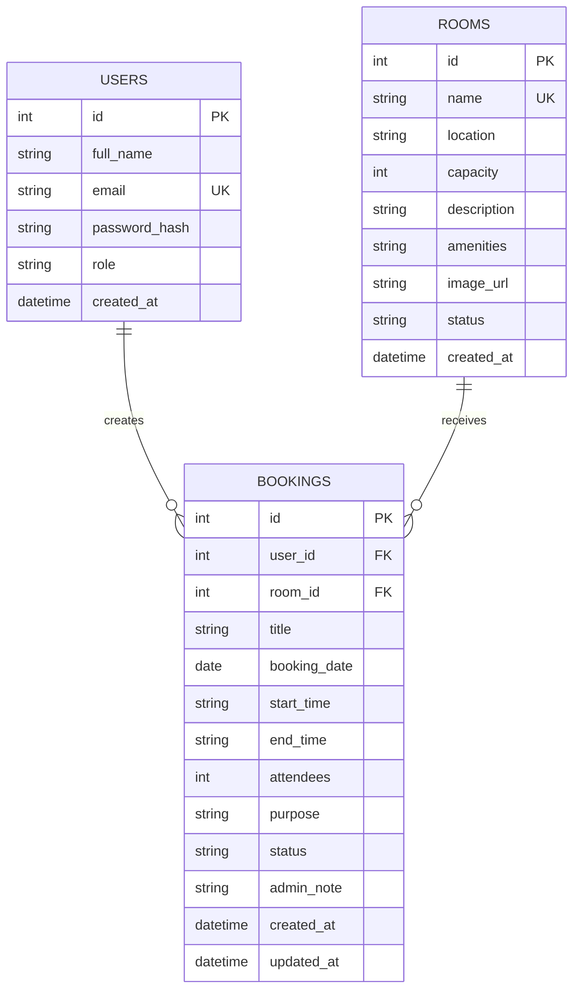

# VenueFlow Schema Overview

## Tables

### `users`

- `id` - primary key
- `full_name` - member or administrator name
- `email` - unique email address
- `password_hash` - securely hashed password
- `role` - either `member` or `admin`
- `created_at` - account creation timestamp

### `rooms`

- `id` - primary key
- `name` - unique meeting-room name
- `location` - physical location of the meeting room
- `capacity` - maximum number of attendees
- `description` - detailed room profile used on the room details page
- `amenities` - comma-separated list of features
- `image_url` - room preview image path or URL
- `status` - either `available` or `maintenance`
- `created_at` - room creation timestamp

### `bookings`

- `id` - primary key
- `user_id` - foreign key referencing `users.id`
- `room_id` - foreign key referencing `rooms.id`
- `title` - booking title
- `booking_date` - reserved calendar date
- `start_time` - reservation start time
- `end_time` - reservation end time
- `attendees` - number of participants
- `purpose` - booking description
- `status` - `pending`, `approved`, `rejected`, or `cancelled`
- `admin_note` - moderation note for approvals or rejections
- `created_at` - booking submission timestamp
- `updated_at` - latest status update timestamp

## Relationship Summary

- One `user` can create many `bookings`
- One `meeting room` can appear in many `bookings`
- Each `booking` belongs to exactly one `user`
- Each `booking` targets exactly one `room`

## ER Diagram

